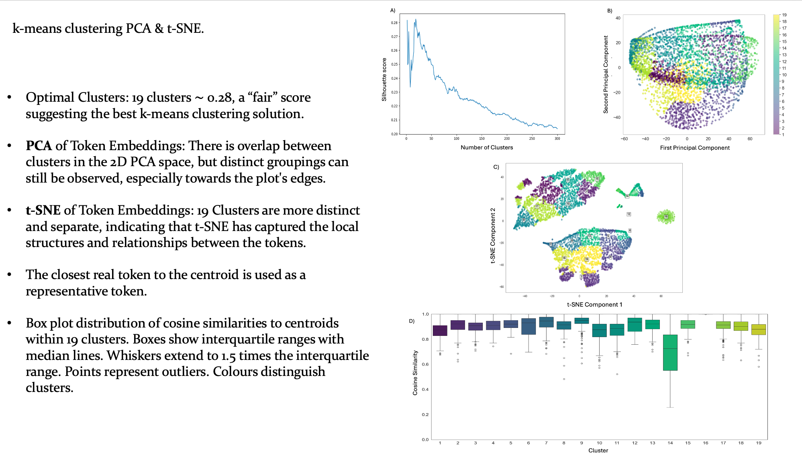

## **Background and Motivation** 

**Primary Aim** 
- Utilise structure tokenizer and codebook to generate embeddings for protein pockets. 

**Objectives** 

1) Conduct a consistency check across multiple similar structures to validate reliability.

2) Generate token embeddings for known binding pockets (688 pairs the HOLO4K-AlphaFold2 Paired)

3) Benchmark against SOTA descriptors. (FPocket, LIGSITE, DEEPSITE) 

4) Evaluate protein similarity using various metrics. Train a model specifically for binding pocket analysis.

## **Results** 

**Limitations** 
- Structural Oversimplification: The reduced codebook and DSSP correlation may oversimplify complex local protein environments.

- Token 16: Represents valine as coiled exposed 100% of the time. A possible error is handling 

**Conclusions**

- Effective Structural Abstraction: The reduced codebook shows relevant representations that capture the local environments, secondary structures, and solvent accessibility independent of amino acid identity.

- Need for a most efficient, light-weight, and compression- friendly protein structure tokenization method to create codebooks with less noise will benefit representation learning. 

**Future Works**

- Test the reconstruction capabilities when with reduced codebook. 

- Combine the structural tokens with sequence-based embeddings to create a more comprehensive protein representation

- Benchmark against SOTA descriptors: (FPocket, LIGSITE, DEEPSITE) 

- **Binding Site Prediction Model**: Develop a model using the reduced codebook embeddings to predict ligand binding sites, comparing its performance to existing methods.

**Dataset:**
- Train model on 6,550 families from Binding MOAD database (centroid structure has < 25% sequence identity to all protein in the test set)

- Labelling Binding Residues: Residues on the centroid structure that are within 5Å of the ligand are labelled as binding residues. 

- Non-Binding Residues: Residues that are not within this 5Å distance to any ligand in the leader or member proteins are labelled as non-binding.

- Only residues with a SASA > 0.2 will be included in the dataset. 

**Model training:** 

- AutoML tools/LightGBM to train models for all datasets. 

- Use binary classification objective with a binary_logloss loss function (suitable for binary classification tasks like distinguishing between binding and non-binding residues) 

